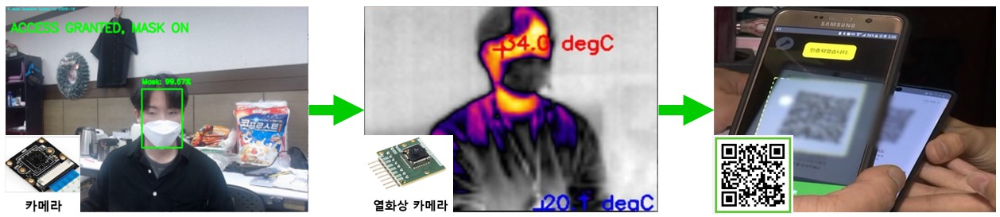
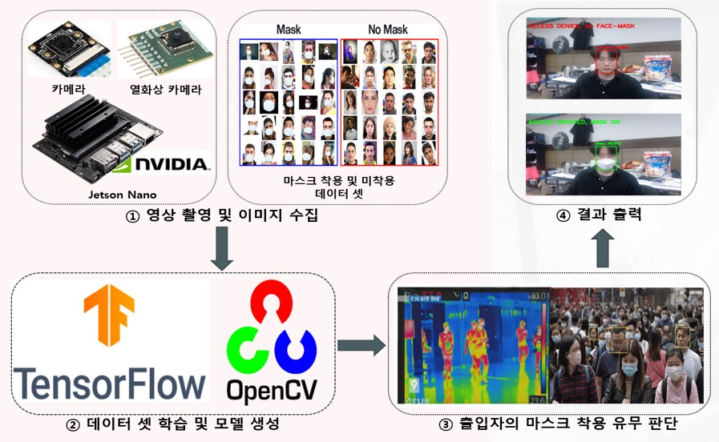

# Deep Mask : COVID-19 확산 방지를 위한 마스크 미착용자 자동식별  인공지능 시스템

### 개요

현재, 전 세계적으로 코로나 바이러스(COVID-19)감염자는 나날이 늘어가고 있습니다.
마스크 없이는 외부활동을 못하는 상황이며 공공장소를 출입할 때 대면으로 체온 측정과 방문자 조회를 합니다. 저희는 AI를 활용해 마스크 착용 판별, 체온 측정, 방문자 조회를 모두 통합하여 AMAZON GO 와 같은 통합된 무인 자동화 시스템을 개발했습니다.
본 프로젝트는 크게 3단계로 나뉘어 출입자를 통제합니다.
 
    AI를 통한 마스크 미착용자 식별 -> 발열유무 체크 -> QR코드를 이용한 출입명부 작성
    

### 활용방안

+ 기존 시스템보다 저렴한 가격대를 형성
+ 자동화 무인 시스템으로 별도의 통제인력이 필요치 않아, 인력 낭비 감소
+ 역학 조사용 데이터를 수집, 분석 및 활용에 용이

### 구조도

